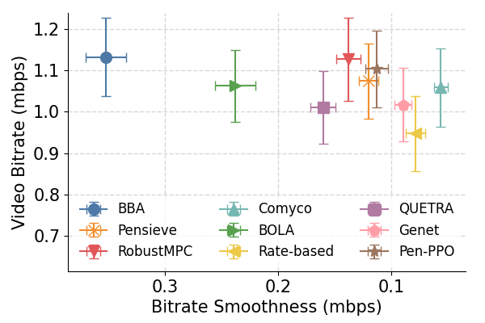
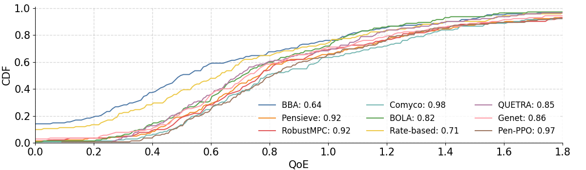

# Pensieve PPO

### Updates

**May. 4, 2024:** We removed the Elastic, revised  BOLA, and add new baseline Comyco [3] and Genet [2].

**Jan. 26, 2024:** We are excited to announce significant updates to Pensieve-PPO! We have replaced TensorFlow with PyTorch, and we have achieved a similar training speed while training models that rival in performance.

*For the TensorFlow version, please check [Pensieve-PPO TF Branch](https://github.com/godka/Pensieve-PPO/tree/master).*

**Dec. 28, 2021:** In a previous update, we enhanced Pensieve-PPO with several state-of-the-art technologies, including Dual-Clip PPO and adaptive entropy decay.

## About Pensieve-PPO

Pensieve-PPO is a user-friendly PyTorch implementation of Pensieve [1], a neural adaptive video streaming system. Unlike A3C, we utilize the Proximal Policy Optimization (PPO) algorithm for training.

This stable version of Pensieve-PPO includes both the training and test datasets.

You can run the repository by executing the following command:

```
python train.py
```

The results will be evaluated on the test set (from HSDPA) every 300 epochs.

## Tensorboard Integration

To monitor the training process in real time, you can leverage Tensorboard. Simply run the following command:

```
tensorboard --logdir=./
```

## Pretrained Model

We have also added a pretrained model, which can be found at [this link](https://github.com/godka/Pensieve-PPO/tree/torch/src/pretrain). This model demonstrates a substantial improvement of 7.03% (from 0.924 to 0.989) in average Quality of Experience (QoE) compared to the original Pensieve model [1]. For a more detailed performance analysis, refer to the figures below:

<p align="center">
    
</p>
<p align="center">
    
</p>
If you have any questions or require further assistance, please don't hesitate to reach out.

## Additional Reinforcement Learning Algorithms

For more implementations of reinforcement learning algorithms, please visit the following branches:

- DQN: [Pensieve-PPO DQN Branch](https://github.com/godka/Pensieve-PPO/tree/dqn)
- SAC: [Pensieve-PPO SAC Branch](https://github.com/godka/Pensieve-PPO/tree/SAC) or [Pensieve-SAC Repository](https://github.com/godka/Pensieve-SAC)

[1] Mao H, Netravali R, Alizadeh M. Neural adaptive video streaming with Pensieve[C]//Proceedings of the Conference of the ACM Special Interest Group on Data Communication. ACM, 2017: 197-210.

[2] Xia, Zhengxu, et al. "Genet: automatic curriculum generation for learning adaptation in networking." Proceedings of the ACM SIGCOMM 2022 Conference. 2022.

[3] Huang, Tianchi, et al. "Comyco: Quality-aware adaptive video streaming via imitation learning." Proceedings of the 27th ACM international conference on multimedia. 2019.